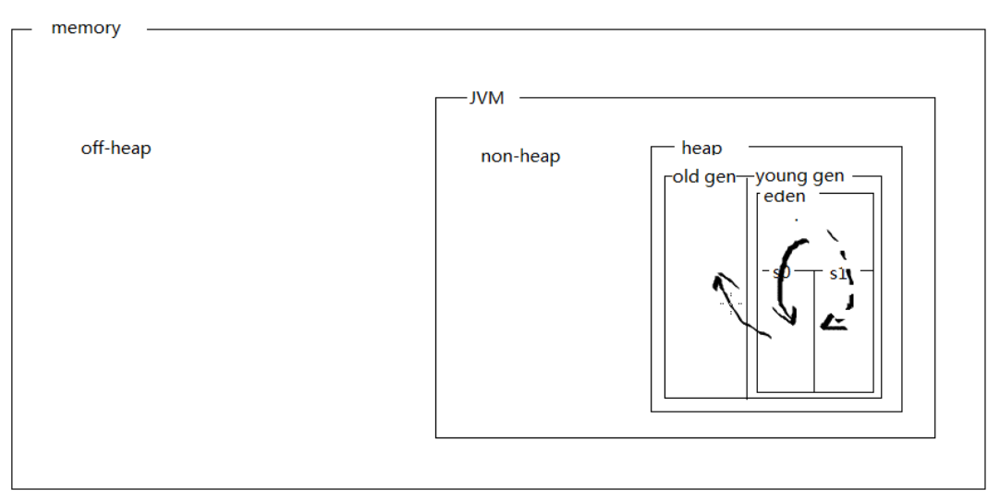

## 1，栈内存和堆内存

* 内存简单理解可以分为：堆内存，栈内存和方法区。
* 堆内存主要存对象，数组等，如果无限制的循环的往数组中添加对象，很快就会造成堆内存满
* 栈内存主要存储主函数和调用的方法？，比如说迭代循环调用很快就会造成栈内存压力过大，栈内存溢出
* 方法区主要存储静态变量和静态方法？？？
* 监控中的几个内存分区：
* --------------------heap--------------------
* 1，Eden区，伊甸区，当前运行的一些内存主要在这里
* 2, S0, 也就是幸存一区，Eden区的对象被gc，回收后会先进入到幸存一区
* 3, S1, 也即是幸存二区，幸存一区的对象会被回收到幸存二区
* 4，old,也就是年老区
* ------------1-3都是年轻代，4是年老代，这四个都是heap？，也就是堆内存------
* -------------------non-heap,非堆--------------------
* 5，metaspace, 也即是方法区，非堆，这里是JVM中heap以外的区域
* --------------------off-heap, 离堆------------------
* 6，off-heap, 这是离堆，其实已经是jvm外的内存





### 1.1， 栈内存
* 栈内存是主要存储主函数和方法的，先进后出
* 主函数先压进去，然后是压如主函数先执行的方法，再压入主函数中后面的方法，之后后面的方法执行完了之后出栈，之后是前面的方法执行结束出栈，最后主函数执行完成，主函数出栈，程序结束
* 栈内存默认是1M
> idea中更改堆内存的方法：VM options：-Xss10M -ea  
> 默认不写的话是1M

### 1.2，堆内存

## 2，一些代码演示

```java
package im.ivanl001.bigData.java_01;

import org.junit.Test;

import java.util.ArrayList;
import java.util.List;

/**
 * #author      : ivanl001
 * #creator     : 2018-10-10 19:21
 * #description :
 **/
public class A03_JVMAbout {

    //这里演示了一个因为循环调用导致的栈内存溢出的报错
    //栈内存中主要存储方法等，如果循环调用就会造成栈内存溢出
    @Test
    public void jvmStackOverflowTest(){
        callSelf(0);
    }

    public void callSelf(int n) {
        System.out.println(n);
        n += 1;
        try {
            Thread.sleep(1);
        } catch (InterruptedException e) {
            e.printStackTrace();
        }
        System.out.println("--------------"+n);
        callSelf(n);
    }

    //这里演示以下堆内存不断增加的案例
    //堆中主要存储对象和数组，如果对象和数组不断增加，就会不断的增加堆内存
    @Test
    public void jvmHeapMemory(){

        List<byte[]> list = new ArrayList<>();
        for (;;) {
            list.add(new byte[1024 * 1024]);
        }

        /*//如果去掉
        List<Cat> cats = new ArrayList<>();
        int i = 0;
        for (;;) {
            cats.add(new Cat());
            System.out.println(i++);
            System.out.println("count:" + cats.size());
        }*/
    }

    @Test
    public void jvmGC(){
        for (;;) {
            byte[] b = new byte[1024 * 1024 * 256];//这里是可以直接被回收调的,回收机制：内存快满的时候进行回收

            //如果想要手动的进行回收如下：
            System.gc();
        }
    }
}

```