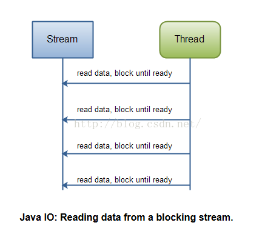
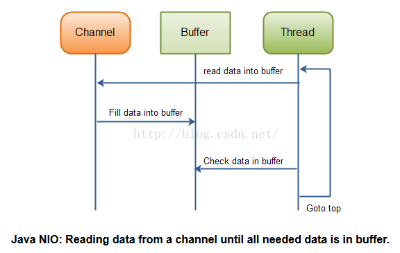
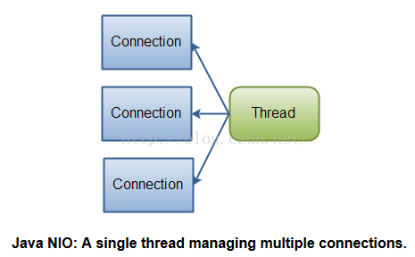
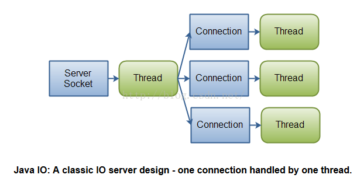

```java
IO  :
--------------------------
	ServerSocket		//同步阻塞
	Socket				//accept
	in.read()


NIO :	ByteBuffer + Channel
-----------------------------
	轮询.
```


https://segmentfault.com/a/1190000013935034

http://ifeve.com/java-nio-vs-io/comment-page-1/#comment-25267


# 一、前言

学习了Java IO 和 NIO之后，肯定会问：我们到底什么时候该使用 IO，什么时候该使用 NIO?
在下文中我会尝试用例子阐述java NIO 和IO的区别，以及它们对你的设计会有什么影响。


# 二、NIO和IO的主要区别

| IO               | NIO                 |
| :--------------- | :------------------ |
| 面向流（Stream） | 面向缓冲（Buffer）  |
| 阻塞IO           | 非阻塞IO            |
| 无               | 选择器（Selectors） |

## 2.1 面向流与面向缓冲

Java NIO 和 IO 之间第一个最大的区别是，IO是面向流的，NIO是面向缓冲区的。

Java IO 面向流意味着每次从流中读一个或多个字节，直至读取所有字节，只能顺序读取所有数据。如果想要跳过一些字节或者想要读取已经读取过的数据，则必须将从流中的数据线缓存起来。

Java NIO的处理方式不一样。数据一开始就被读写到缓冲区（Buffer），根据需要你可以控制读取什么位置的数据。这就增加了处理过程中的灵活性。然而，你需要额外做的工作是检查你需要的数据是否已经全部到了Buffer中，你还需要保证当有更多的数据进入Buffer中时，Buffer中未处理的数据不会被覆盖


## 2.2 阻塞与非阻塞IO

Java IO的各种流是阻塞的。这意味着，当一个线程调用read() 或 write()时，该线程被阻塞，直到有一些数据被读取，或数据完全写入。该线程在此期间不能再干任何事情了。

Java NIO的非阻塞模式，使一个线程从某通道发送请求读取数据，但是它仅能得到目前可用的数据，如果目前没有数据可用时，就什么都不会获取。而不是保持线程阻塞，所以直至数据变的可以读取之前，该线程可以继续做其他的事情。 非阻塞写也是如此。一个线程请求写入一些数据到某通道，但不需要等待它完全写入，这个线程同时可以去做别的事情。 线程通常将非阻塞IO的空闲时间用于在其它通道上执行IO操作，所以一个单独的线程现在可以管理多个输入和输出通道（channel）。


## 2.3 Selectors

Java NIO 的 Selectors 允许一条线程去监控多个 channels 的输入，你可以向一个 selector 上注册多个channel，然后调用 selector 的 select() 方法判断是否有新的连接进来或者已经在 selector 上注册时channel 是否有数据进入。selector 的机制让一个线程管理多个 channel变得简单。


# 三、NIO和IO对应用的设计有何影响

选择使用NIO还是IO做你的IO工具对应用主要有以下几个方面的影响
1、使用IO和NIO的API是不同的（废话）
2、处理数据的方式
3、处理数据所用到的线程数


## 3.1 API调用

当然，使用NIO的API调用时看起来与使用IO时有所不同，但这并不意外，因为并不是仅从一个InputStream逐字节读取，而是数据必须先读入缓冲区再处理。


## 3.2 处理数据的方式

在IO的设计里，要一个字节一个字节从InputStream 或者Reader中读取数据，想象你正在处理一个向下面的基于行分割的流

```properties
Name:Anna  
Age: 25  
Email: anna@mailserver.com  
Phone:1234567890  
```

处理文本行的流的代码应该向下面这样

```java
InputStream input = ... ; // get the InputStream from the client socket  
  
BufferedReader reader = new BufferedReader(new InputStreamReader(input));  
  
String nameLine   = reader.readLine();  
String ageLine    = reader.readLine();  
String emailLine  = reader.readLine();  
String phoneLine  = reader.readLine(); 
```

注意，一旦reader.readLine()方法返回，你就可以确定整行已经被读取，readLine()阻塞知道一整行都被读取



NIO的实现会有一些不同，下面是一个简单的例子

```java
ByteBuffer buffer = ByteBuffer.allocate(48);  
  
int bytesRead = inChannel.read(buffer);  
```


注意第二行从channel中读取数据到ByteBuffer，当这个方法返回你不知道是否你需要的所有数据都被读到buffer了，你所知道的一切就是有一些数据被读到了buffer中，但是你并不知道具体有多少数据，这使程序的处理变得稍微有些困难

想象一下，调用了read(buffer)方法后，只有半行数据被读进了buffer，例如：“Name: An”，你能现在就处理数据吗？当然不能。你需要等待直到至少一整行数据被读到buffer中，在这之前确保程序不要处理buffer中的数据

你如何知道buffer中是否有足够的数据可以被处理呢？你不知道，唯一的方法就是检查buffer中的数据。可能你会进行几次无效的检查（检查了几次数据都不够进行处理），这会令程序设计变得比较混乱复杂


```java
ByteBuffer buffer = ByteBuffer.allocate(48);  
  
int bytesRead = inChannel.read(buffer);  
  
while(! bufferFull(bytesRead) ) {  
    bytesRead = inChannel.read(buffer);  
}  
```


bufferFull()方法必须跟踪有多少数据读入缓冲区，并返回真或假，这取决于缓冲区是否已满。换句话说，如果缓冲区准备好被处理，那么表示缓冲区满了。

bufferFull()方法扫描缓冲区，但必须保持在bufferFull（）方法被调用之前状态相同。如果没有，下一个读入缓冲区的数据可能无法读到正确的位置。这是不可能的，但却是需要注意的又一问题。

如果缓冲区已满，它可以被处理。如果它不满，并且在你的实际案例中有意义，你或许能处理其中的部分数据。但是许多情况下并非如此。下图展示了“缓冲区数据循环就绪”：





## 3.3 用来处理数据的线程数

NIO可让您只使用一个（或几个）单线程管理多个通道（网络连接或文件），但付出的代价是解析数据可能会比从一个阻塞流中读取数据更复杂。

1. 如果需要管理同时打开的成千上万个连接，这些连接每次只是发送少量的数据，例如聊天服务器，实现NIO的服务器可能是一个优势。同样，如果你需要维持许多打开的连接到其他计算机上，如P2P网络中，使用一个单独的线程来管理你所有出站连接，可能是一个优势。一个线程多个连接的设计方案如下图所示：



2. 如果你只有少量的连接但是每个连接都占有很高的带宽，同时发送很多数据，传统的IO会更适合。下图说明了一个典型的IO服务器设计：




