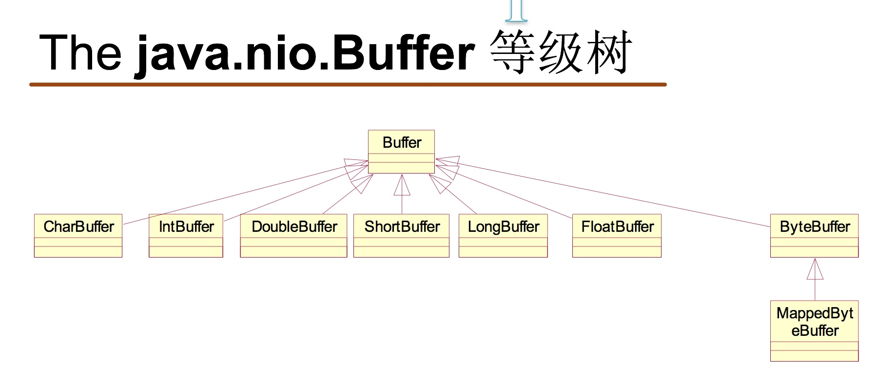
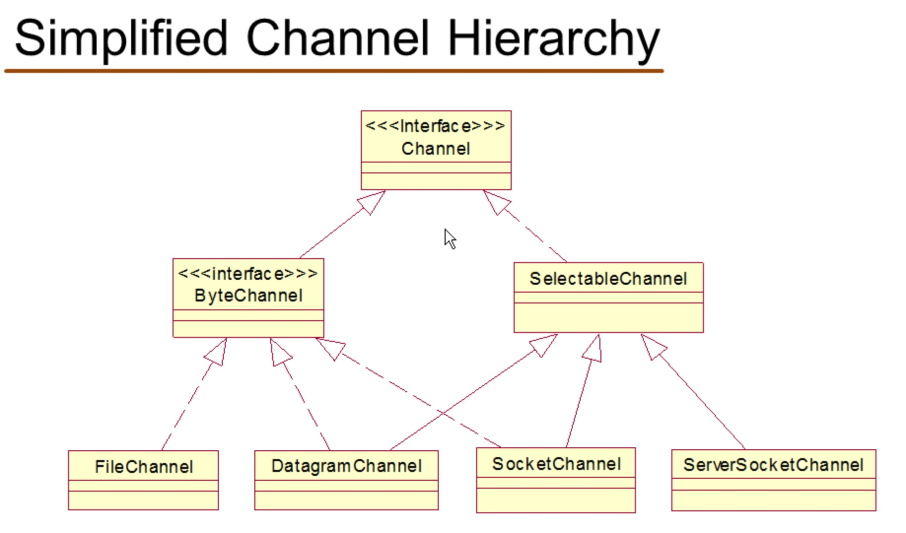

> NIO: non-block io 无阻塞IO

> 举个简单的例子：比如之前socket中的tcp案例的话：每一个socket客户端，需要同时开启两个线程：一个循环不断的发送消息，一个用来不间断的接受消息。多个socket客户端的话，每个客户端同样也是需要创建两个线程。对于服务器端的serverSocket也是一样，accept方法每次接受到客户端连接，都需要创建一个线程。如果有很多客户端同时连接，但是却没有发送消息，就会创建很多线程进行等待，会造成较大的浪费

> NIO的概念我的理解如下：比如说服务器端，每次接收到客户端的时候，我们不再创建新的线程，还是照样放在一个线程中，而且我会有一个选择器，把那些有发送消息的socket给挑选出来，然后在同一个线程中，对选择器中的选出来有消息的socket进行循环快速处理

> 

## 1，Buffer的几个概念，Buffer主要用于NIO中

> Buffer是NIO中操作数据的主要方式，比如说文件IO的时候，如果是常规的方式应该是：把文件读入到系统内存，系统内存再copy到JVM的内存中，JVM的内存再对那些字节进行相应的操作。也就是从离堆拷贝到堆内存中。但是Buffer可以直接操纵离堆内存，省去了copy的步骤，效率更高一些。

> Buffer的话是不需要直接操作字节的，直接可以调用Buffer的相关方法即可

* mark        	# 标记, 需要小于位置， 方便后续进行reset，reset后就会重新从mark的位置进行读取
* position       # 位置, 需要小于限制，也就是文件读到的位置，下次从这里开始读就可以了
* limit              # 限制, 需要小于容量, 比如容量是8个空间，那么限制7的话只能使用8中的7个空间
* capacity       # 容量，比如是8个空间
* 代码注释中如下说

```java
A buffer's capacity is the number of elements it contains. The capacity of a buffer is never negative and never changes.
  
A buffer's limit is the index of the first element that should not be read or written. A buffer's limit is never negative and is never greater than its capacity.
  
A buffer's position is the index of the next element to be read or written. A buffer's position is never negative and is never greater than its limit.
  
  
clear makes a buffer ready for a new sequence of channel-read or relative put operations: It sets the limit to the capacity and the position to zero.
  
flip makes a buffer ready for a new sequence of channel-write or relative get operations: It sets the limit to the current position and then sets the position to zero.
  
rewind makes a buffer ready for re-reading the data that it already contains: It leaves the limit unchanged and sets the position to zero.
```


### 1.1, 简单的理解

* *我的简单理解就是：容量是这块缓存是多大*
* 之前的理解不过，直接删掉了，看官方注视
```java
// 下面这个叫做拍板，拍板好之后就可以准备写出数据了
//fter a sequence of channel-read or <i>put</i> operations, invoke this method to prepare for a sequence of channel-write or relative <i>get</i> operations.

public final Buffer flip() {
    limit = position;//定义以下最大的位置，写出的时候的终点位置
    position = 0; 
    mark = -1;
    return this;
}
```



* ByteBuffer下有两个子类：HeapByteBuffer(A read/write HeapByteBuffer)和MappedByteBuffer(离堆内存)
* MappedByteBuffer有一个子类：DirectByteBuffer，ByteBuffer.allocateDirect其实返回的就是DirectByteBuffer，同时下面需要用到的清理类Cleaner也是在DirectByteBuffer中
* HeapByteBuffer中是没有清理方法的，好像只有DirectByteBuffer，也就是离堆内存才会清理，可能是对内存方法有垃圾回收机制，然后可以自动的进行回收清理吧


### 1.2，操纵离堆内存和非堆内存
```java
//第二个其实就是离堆内存，也就是虚拟机外部的，也就是系统堆内存
@Test
public void byteBuffer() {

    //在这里操纵内存
    System.out.println("开始～");

    //这里内存是Old区的，是在jvm内存的一个年老区
    ByteBuffer.allocate(500 * 1024 * 1024);
  
    //这里的分配的直接内存缓冲区，内存是jvm之外的，其实也就是系统的内存
    ByteBuffer.allocateDirect(500 * 1024 * 1024);

    System.out.println("搞定～");
}
```

## 2，Channel
* channel 是java.nio中的新的抽象
* channel是一个在打开File或是Socket上执行IO操作或者是各种控制操作的句柄。
* java.nio使用 RandomAccessFile, FileInputStream, FileOutputStream, Socket, ServerSocket or DatagramSocket object关联通道。
* channel提供了NIO的特定功能。
* `NIO buffer可以直接对channel进行读写.`



### 2.1, FileChannel
* 2.1.1, 通过文件通道快速的操纵文件等,还可以通过ByteBuffer对象调用方法操纵字节数组
```java
//文件通道，其实就是FileInputStream和FileOutputStream的NIO方法
@Test
public void fileChannelTest() throws IOException {

    FileInputStream fileInputStream = new FileInputStream("/Users/ivanl001/Desktop/from/01.jpg");
    //这里和bufferedInputStream有点类似
    FileChannel fileChannel = fileInputStream.getChannel();

    FileOutputStream fileOutputStream = new FileOutputStream("/Users/ivanl001/Desktop/to/01.jpg");
    FileChannel fileChannel1 = fileOutputStream.getChannel();

    //return new HeapByteBuffer(capacity, capacity);，下面这个操作的是堆内存
    //这里我们直接通过ByteBuffer操纵字节数组，不需要像byte[] bytes = new byte[1024];这样还要手动的处理这些字节数组
    ByteBuffer byteBuffer = ByteBuffer.allocate(1024);
    while (fileChannel.read(byteBuffer) != -1) {
        byteBuffer.flip();//flip的作用应该是自动检测写出的长度，就像fileOutputStream.write(bytes, 0, offset);需要指定offset一样
        fileChannel1.write(byteBuffer);
        byteBuffer.clear();
    }

    fileChannel.close();
    fileChannel1.close();


    /*//2,1024字节缓存读取
    int offset = 0;
    byte[] bytes = new byte[1024];
    while ((offset = fileInputStream.read(bytes)) != -1) {
        fileOutputStream.write(bytes, 0, offset);
    }
    fileInputStream.close();
    fileOutputStream.close();*/
}
```
* 2.1.2，把文件映射到内存中，通过操纵内存来操纵文件，速度快，这里操纵的是对内存
```java
//这里的作用是把文件映射到内存中，同时和文件同步，不会阻塞，读取和改写速度比较快，同时可以同步到文件中
@Test
public void ramdomAccessFileMap() throws IOException {

    File file = new File("/Users/ivanl001/Desktop/from/zhang.txt");
    RandomAccessFile randomAccessFile = new RandomAccessFile(file, "rw");
    Long length = randomAccessFile.length();
    System.out.println(length);
    //这个是Buffer的子类
    MappedByteBuffer mappedByteBuffer = randomAccessFile.getChannel().map(FileChannel.MapMode.READ_WRITE, 0, 5);
    for (int i=0;i<mappedByteBuffer.capacity();i++) {
        System.out.println((char)mappedByteBuffer.get(i));
    }

    //这里是修改某些字节的值，通过掉方修改，不需要直接操纵字节数组来更改
    mappedByteBuffer.put(0, (byte)'a');
}
```

