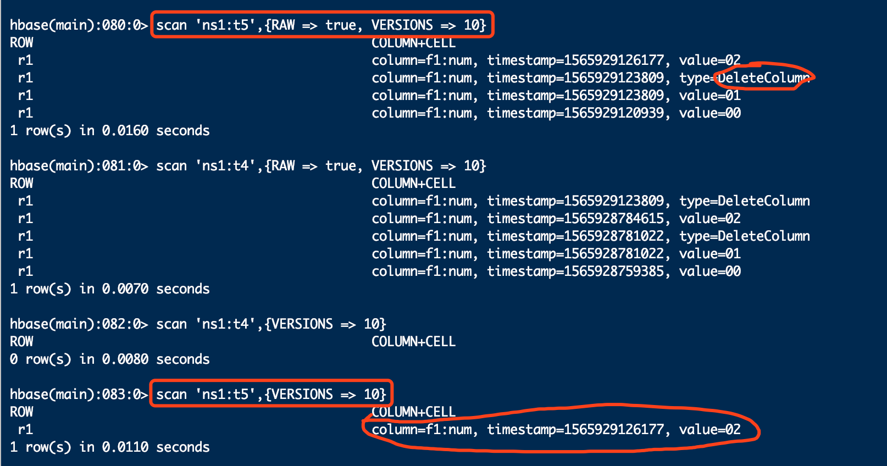
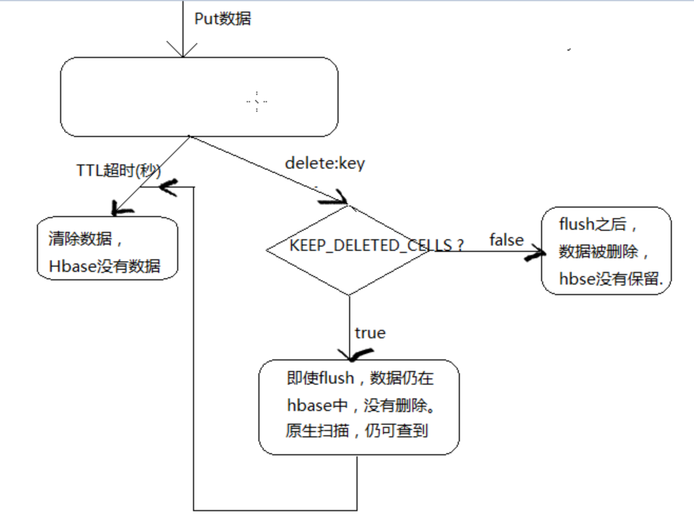

# HBase shell的使用

> 如果命令行不能退格，使用shift+delete即可退格，或者ctrl+delete


## 1, DQL: 基本命令

### 1.1, 登陆shell窗口

 ```shell
hbase shell
 ```


### 1.2, 查看帮助

```shell
# 查看大帮助
help

# 查看指定帮助
help 'flush'
```


### 1.3, 查看hbase状态

```shell
status
```


### 1.4, 显示namespace(数据库)

```shell
list_namespace
```


### 1.5, 显示namespace下的表

```shell
list_namespace_tables 'ns1'
```


### 1.6, 查看表描述

```shell
describe 'ns1:t1'

# 显示内容如下：
hbase(main):047:0> desc 'ns1:t1'
Table ns1:t1 is ENABLED                                                                                                                                                             
ns1:t1                                                                                                                                                                              
COLUMN FAMILIES DESCRIPTION                                                                                                                                                         
{NAME => 'f1', BLOOMFILTER => 'ROW', VERSIONS => '1', IN_MEMORY => 'false', KEEP_DELETED_CELLS => 'FALSE', DATA_BLOCK_ENCODING => 'NONE', TTL => 'FOREVER', COMPRESSION => 'NONE', M
IN_VERSIONS => '0', BLOCKCACHE => 'true', BLOCKSIZE => '65536', REPLICATION_SCOPE => '0'}                                                                                           
1 row(s) in 0.0510 seconds
```


### 1.6, 查询指定定位的内容

* 如下可以指定行列，也可以加上时间戳进行三级定位查询

```shell
get 'ns1:t1' ,'r1'
get 'ns1:t1', 'r1', 'f1:c1'
get 't1', 'r1', {TIMERANGE => [ts1, ts2]}
```


### 1.7, 扫描表

* 可以获取全部的行列数据，据说也能获取全部时间戳的数据，但是我在测试的时候只能获取最新的，可能是版本不一致或者是需要设置一下，先放着

```shell
scan 'ns1:t1'

# 扫描元数据表
scan 'hbase:meta'

# 扫描的时候需要指定要扫描的版本数
# 比如说创表指定版本3，但是这里版本10，然后存了4个版本的时候，扫描的时候还是能扫出4个版本
# 如果去掉RAW => true，就是能扫出3个版本，因为创建表的时候就是3个版本
# 如果删除某个时间戳，会在该时间戳处添加一个删除标记，默认情况下，flush之后，数据就会完全删除，原生扫描也扫不到。注意：要flush才会真的删除，因为内存中会保存，所以要flush
scan 'ns1:t2',{RAW => true, VERSIONS => 10}

# 这里get只能get到3个版本
get 'ns1:t2','r1', {COLUMN => 'f1', VERSIONS => 4}
get 'ns1:t2','r1', {COLUMN => 'f1', TIMERANGE => [ts1, ts2], VERSIONS => 4}
```





### 1.8, 查看表行数

- 统计表数据条数(每1000条统计一次)
- 注意：这里是按行统计的

```shell
count 'ns1:t1'
```


### 1.9, 获取计数器

- 获取一个通过计数器增加的数值，数字scan，或者默认get获取出来显示是十六进制

```shell
get_counter 'ns1:counters', 'r1', 'f1:click'
```


### 2.0, KEEP_DELETED_CELLS(这个好像没啥用了)

* ⚠️：TTL是到底就彻底删除，不管怎么样都不会保存
* 

```shell
# 那么一旦删除一个字段某一个时间戳内容，就会在这个时间戳这里添加一个标记
# flush之后，会保留3个副本，其他的删除，三个副本就算在删除时间戳之前也会保留
create 'ns1:t4', {NAME => 'f1', VERSIONS => 3, KEEP_DELETED_CELLS=> TRUE}
create 'ns1:t6', {NAME => 'f1', VERSIONS => 3, KEEP_DELETED_CELLS=> TRUE, TTL => 10}


```





## 2, DDL：数据库定义

### 2.1, 创建namespace

```shell
create_namespace 'ns1'
```


### 2.2, 创建表

* 下面NAME需要大写才行

```shell
create 'ns1:t1', {NAME=>'f1'}
# 如果只有一个列族，可以用这个，多个列族不行的哈
create 'ns1:t2', 'f1' 

create 'ARIES:t1', {NAME=>'f1'}

# VERSIONS：指定存储几个版本，版本号是针对列族的
create 't1', {NAME => 'f1', VERSIONS => 1, TTL => 2592000, BLOCKCACHE => true}
create 'ns1:t2', {NAME => 'f1', VERSIONS => 3}

# 扫描的时候需要指定要扫描的版本数
# 比如说创表指定版本3，但是这里版本10，然后存了4个版本的时候，扫描的时候还是能扫出4个版本
scan 'ns1:t2',{RAW => true, VERSIONS => 10}
# 注意：一旦删除某个版本数据，这个版本数据之前的数据，就会彻底删除，原生扫描也找不到

# 这里get只能get到3个版本
get 'ns1:t2','r1', {COLUMN => 'f1', VERSIONS => 4}

create 'ns1:t4', {NAME => 'f1', VERSIONS => 3, KEEP_DELETED_CELLS=> TRUE}
```


### 2.3, TTL

```shell
# 单位秒
create 'ns1:t3', {NAME=>'f1', TTL=>10}
# 一旦过期，彻底删除，原生扫描也无效
scan 'ns1:t3',{RAW => true, VERSIONS => 10}
```


## 3, DML: 数据库操纵

> 给表插入数据,注意：hbase是nosql，插入的时候需要指定插入的目录是哪一行，那一列族，然后是这一列族的哪一列（一个列族中可以有多列），同时还有时间戳的概念，也就是如果对同一坐标的目标位置连续插入，就会通过更改时间戳进行保存，注意：严格意义上来说，这里不是覆盖, 而是不同时间戳的保存。
>
> 所以hbase就是三级定位：行，列(列族,具体列)和时间戳


### 3.1, 插入

* 这个同时也算是更新操作，如果存在就更新，不存在保存哈

```shell
put 'ns1:t1', 'r1', 'f1:c1', 'ivanl001 is the king of world!'

put 'ARIES:t1', 'r1', 'f1:c1', 'ivanl001 is the king of world!'
```


### 3.2, 删除数据内容

```shell
delete 'ns1:t1', 'r1', 'f1:c1'
```


### 3.3, 删除表

* 需要先禁用表

```shell
disable 'ns1:t1'
drop 'ns1:t1'
```


### 3.4, 手动切割表

```shell
# 直接切分表
split 'tableName'
split 'namespace:tableName'
# 直接切分分区
split 'regionName' # format: 'tableName,startKey,id'
# 使用特定的splitKey来切分表
split 'tableName', 'splitKey'
# 使用特定的splitKey来切分分区
split 'regionName', 'splitKey'
```


* 测试的时候不是从正中切割，不过是在正中附近

```shell
split 'ns1:t1'
```


* 手动指定切割key来切割表


```shell
split 'ns1:t1', 'r0500000'
```


* 如果想要对切片再次切割，可以通过指定切片，其实也可以通过再次指定切割key
  

```shell
split 'ns1:t1', 'r0800000'
# 指定切片还要找切片信息，然后切分特定分区
split 'ns1:test01,r005053541,1565874934086.3c79012701fa77750733f83087e08d37.'
# 切分过程如下图
```


### 3.5, 移动分区


* 手动移动分区位置
  

```shell
# ⚠️注意：移动的时候填写的是编码名，不是区域全名哦
move '4bb967e0d3e223840ab6bf3a116c14eb', 'slave01,16020,1541985382287'
move 'ENCODED_REGIONNAME', 'SERVER_NAME'
```


### 3.6, 合并分区


* 手动合并两个分区(分区在不同的服务器上也是ok的)

```shell
# ⚠️注意：合并的时候填写的是编码名，不是区域全名哦
merge_region 'a6d80b2decb398ea4a31458ce3acfcdb', '8a620eecb41a8fbb25585e7d1f20273b'
merge_region 'ENCODED_REGIONNAME', 'ENCODED_REGIONNAME'
```


### 3.7, 创建表的时候直接切分分区

```shell
# 这种切割的话最好提前设定好rowkey的最小值最大值，这样预切才有意义
create 'ns2:t2', 'f1', SPLITS => ['r3333', 'r6666']
create 'ns1:t1', 'f1', SPLITS => ['10', '20', '30', '40']
```


* 然后如果插c入的时候就会根据大小自动的进行分区到不同的分区上(虽然我们写入的是字符串，但是hbase实际存储的时候的rowKey是字节，所以不论你写的字节是什么内容， 都是有大小的， 所以总是能进行分区, 因为字节本身就可以当作数字)

```shell
# 这个会自动的分到>r6666的分区上
put 'ns2:t2', 'r9900', 'f1:name', 'ivanl000001'
```


### 3.8, 刷写到磁盘

```shell
# 注意：写完之后要flush一下才能把数据写入到文件中去哈
flush 'ns2:t2'
```

