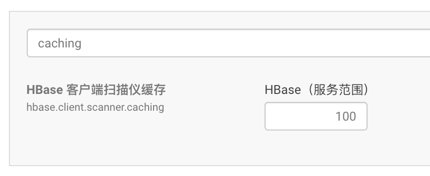
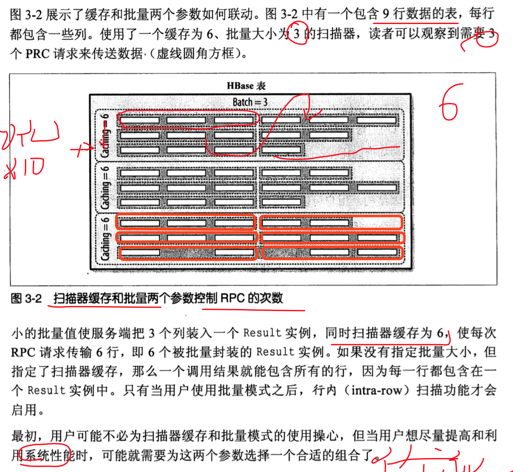

## 1,  批处理合理使用put,batch,muatator

* put是同步操作，底层调用BufferedMutator的flush方法，根据设置中的最大内存大小2M来决定是否flush，如果大于2M进行flush，否则存储到本地缓存
* batch是同步操作，不会进行缓存，而是直接发送到服务器上进行处理
* mutate：和Table的put类似，但是这里不同的是批量的，异步的操作, 也是有缓存，2M为临界值

```verilog
Used to communicate with a single HBase table similar to Table but meant for
batched, asynchronous puts
```


## 2, scan：行级别缓存：caching

* 默认情况下，scan的时候是调用next方法，每调用一次就会像服务器请求一次数据，交互比较频繁
* 可以设置如下参数进行全局优化：

```properties
hbase.client.scanner.caching = 100
```

cdh下hbase的这个参数默认设置100



* 如果只想对某个表临时设置，可以调用java接口：

* ```java
  // Higher caching values will enable faster scanners but will use more memory.
  Scan scan = new Scan();
  scan.setCaching(100);
  ```


## 3, scan：列级别缓存：batch

> setCaching决定每次next会返回多少行
>
> setBatch决定返回的每行有多少列


* 如果只想对某个表临时设置，可以调用java接口：

```java
Scan scan = new Scan();
//Set the number of rows for caching that will be passed to scanners.
scan.setCaching(100);
//Set the maximum number of values to return for each call to next()
scan.setBatch(10);
```




## 3, 使用合适的过滤器


## 4,