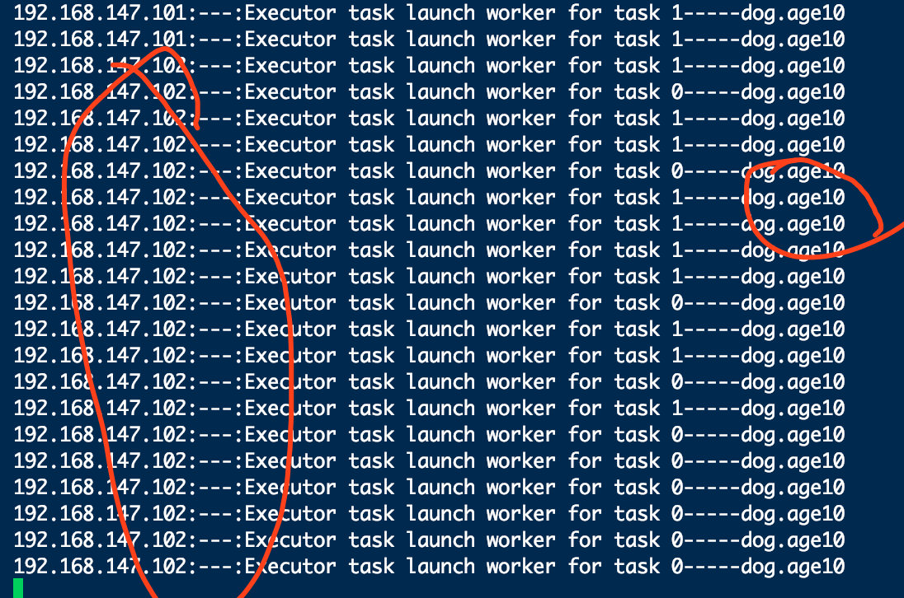

# 广播变量和累加器

> 对于一些可能需要多个服务器，也就是节点共享的数据，可以通过广播变量跨节点传递出去。然后可以在每个节点都可以取到这些变量  


## 1, 广播变量的使用

```scala
//广播变量, 使用上下文广播出去即可, 在其他节点就可以使用
val bc1 = sc.broadcast(Array(1,2,3,4,5))
```


* 如下，如果我在cengos01上提交作业对吧，按理来说，Dog对象只会存在centos01这台机器上，但是根据nc的结果可以看出来，在centos02的机器上也正确打印出了dog的值，说明Dog被正确的广播到其他节点了
* 

```java
package im.ivanl001.bigData.Spark.A07_PersistAndCacheAndBroadcast

import org.apache.spark.{SparkConf, SparkContext}

/**
  * #author      : ivanl001
  * #creator     : 2019-08-18 14:38
  * #description : 
  *
  **/
object A0703_Broadcast_on_yarn {

  def main(args: Array[String]): Unit = {

    //创建Spark配置对象
    val conf = new SparkConf()

    //集群模式下下面两行不要
    conf.setAppName("broadcast_yarn")
    //设置master属性
    //conf.setMaster("spark://master:7077")
    //conf.setMaster("local[2]")//数字是本地模式下开启几个线程模拟多线程
    conf.setMaster("yarn")


    //通过conf创建sc
    val sc = new SparkContext(conf)

    //广播变量
    val bc1 = sc.broadcast(Array(1,2,3,4,5))

    //其实这个案例并不明确，因为样例类也可以传递到其他节点
    case class Dog(age:Int)
    val dog = Dog(10)

    val rdd1 = sc.makeRDD(1 to 20)
    val rdd2 = rdd1.map(e => {
      println("ivanl00" + e)

      val num01 = bc1.value(0)

      //通过这种方式在分布式程序上跑的时候可以看出来都是哪个服务器在跑哪个任务
      //比如说我在cengos01上提交，然后能在centos02上打印出dog.age的大小，就说明这个对象已经广播到其他节点上了
      val info = java.net.InetAddress.getLocalHost.getHostAddress + ":---:" + Thread.currentThread().getName + "-----dog.age" + dog.age + "\n"
      val socket = new java.net.Socket("centos01", 9999)
      val out = socket.getOutputStream
      out.write(info.getBytes())
      socket.close()
      println(info)
      e*2
    })

    rdd2.reduce(_ + _)
    println("finished")
  }
}
```


## 2, 累加器的使用

```scala
//累加器的使用
val acc01 = sc.longAccumulator("acc01")
//在需要的地方进行加1，或者自定义加多少
acc01.add(1)
//然后需要的时候取出来即可
println(acc01.value)
```


```scala
package im.ivanl001.bigData.Spark.A07_PersistAndCacheAndBroadcast
import org.apache.spark.{SparkConf, SparkContext}

object A0704_Accumulator {

  /*
  *
  * 累加器可以自定义的，可以参考LongAccumulator，继承AccumulatorV2可以自定义
  *
   */
  def main(args: Array[String]): Unit = {

    //创建Spark配置对象
    val conf = new SparkConf()

    //集群模式下下面两行不要
    conf.setAppName("WordCountScala")
    //设置master属性
    //conf.setMaster("spark://master:7077")
    conf.setMaster("local[2]")//数字是本地模式下开启几个线程模拟多线程

    //通过conf创建sc
    val sc = new SparkContext(conf)

    //广播变量
    val bc1 = sc.broadcast(Array(1,2,3,4,5))

    //其实这个案例并不明确，因为样例类也可以传递到其他节点
    case class Dog(age:Int)
    val dog = Dog(10)

    //累加器的使用
    val acc01 = sc.longAccumulator("acc01")

    var a = 0
    val rdd1 = sc.makeRDD(1 to 20)
    val rdd2 = rdd1.map(e => {
      println("ivanl00" + e)

      acc01.add(1)
      val num01 = bc1.value(0)
      a = a+1

      //通过这种方式在分布式程序上跑的时候可以看出来都是哪个服务器在跑哪个任务
      val info = java.net.InetAddress.getLocalHost.getHostAddress + ":---:" + Thread.currentThread().getName + "-----" + dog.age + "\n"
      val socket = new java.net.Socket("master", 8888)
      val out = socket.getOutputStream
      out.write(info.getBytes())
      socket.close()
      println(info)
      e*2
    })

    //注意：这里的累加器是可以累加的，这里的值是20,
    //意思是如果分布式计算的话，其实是在不同的机器上进行计算的，假设driver是master节点，我们可以在master节点上直接获取到累加器最后的值，也就是这个值其他节点会回传给driver的。当然用广播也可以实现类似的回传
    println(acc01.value)

    //注意：这里的a还是0
    println(a)

    rdd2.reduce(_ + _)
    println("finished")
  }
}
```

