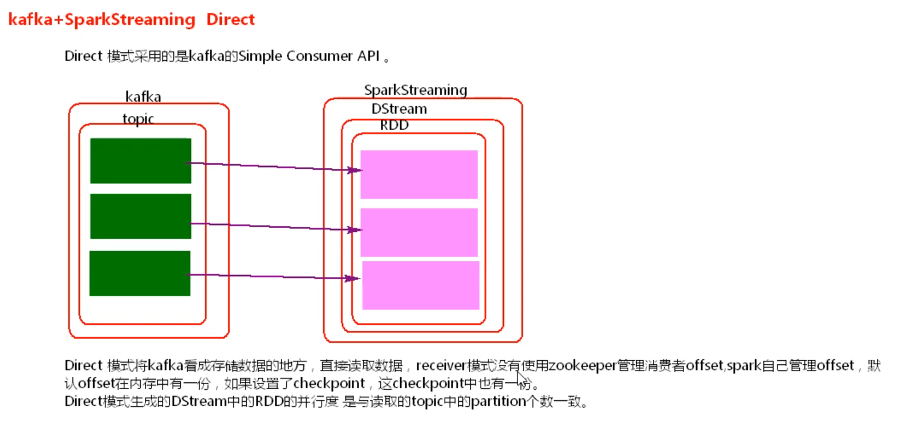
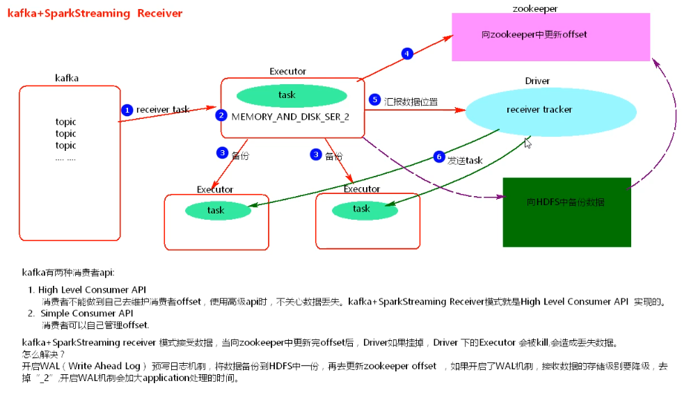

## 1, sparkStreaming消费kafka的两种方式

* http://spark.apache.org/docs/2.1.0/streaming-programming-guide.html#reducing-the-batch-processing-times


### 1.1, Direct模式

```shell
# Direct模式的并行度
Direct下并行度是直接和kafka的分区数一致
kafka分区有三个，我就开三个并行度，和kafka一一对应
```


* 使用kafka的Simple Consume API
* spark自己管理offset，不过一般情况下我们都会自己管理
* 因为spark自己管理，是存储在内存中。ok的，但是如果spark集群down掉的话，数据只能通过checkpoint恢复，如果不修改代码情况下也是ok的，但是一旦修改代码，就不能从原先的checkpoint中恢复了，因为如果从checkpoint中恢复，就是从代码中从工厂里面把原先的代码拿出来，新修改的代码根本不会执行（实际上spark2.1.0中如果修改了代码，而且从checkpoint中恢复，会直接报错哦）




### 1.2, Receiver(现已经废弃)

```shell
# Receiver模式的并行度
由spark.streaming.blockInterval = 200ms决定
Receiver模式接受kafka数据时候，每隔spark.streaming.blockInterval将数据落地到一个block，
假设batchInterval=5s，也就是一个RDD搜集多少时间到数据，那么一个batch内会有5s/200ms = 25个block，
bath中25个block封装到一个RDD中，一个RDD的partition对应一个block，也就会产生25个partition。每个分区会开启一个maptask。

所以想要提高receiver的并行度，减小spark.streaming.blockInterval参数值，增大生成DStream的RDD中的partition数量。

如果想要减少maptask个数，就提高blockInterval的时间。如果想要增加maptask个数，就减少blockInterval时间。不过blockInterval过小的时候会产生大量的block块，maptask的个数也会非常多，每个maptask处理的数据量也就变少了。

所以官方建议：spark.streaming.blockInterval最低不能低于50ms，要不然就会有过量task任务，每个task处理及少量的数据。
```


* 这是一种老的最开始的spark消费kafka的方式
* 采用的是kafka的高级API，high-level API
* 对于kafka的消息，开task进行接受，放在executor中保存，并向zk中更新offset(这种模式只使用在kafka0.8版本或者之前，之后的sparkStreaming就不再支持Receiver模式了，kafka0.8版本的offset是存在zk中的)
* 保存的默认级别是MEMORY_AND_DISK_SER_2，备份，并落地，保存到磁盘是为了保证数据不丢失
* executor接受后，向driver汇报offset，达到一定的数量driver会进行批量处理，把消息发送给其他负责运算的executor中进行处理

```shell
# Receiver模式存在问题
1, 如果在处理过程中，driver服务器down掉，Driver下的Executor会被kill掉(不配置HA模式)，这样会造成数据丢失
2, 为了防止数据丢失，需要开启WALs预写机制，防止数据丢失。如果开始WAL机制，存储数据的保存级别要降低，改成MEMORY_AND_DISK_SER即可。开启后性能会降低！！！
```




